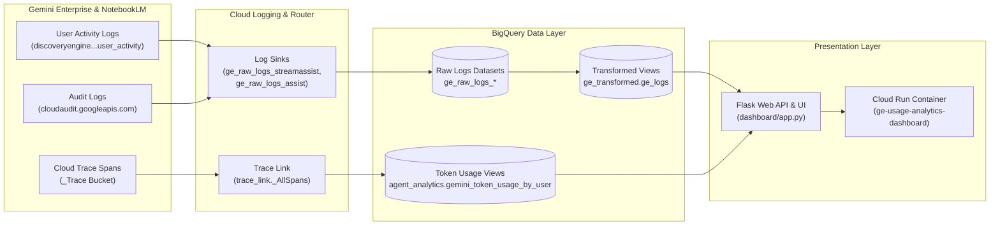

# Gemini Enterprise & NotebookLM Usage Analytics (Sanitized)

> **Disclaimer**: This repository and its contents are provided for illustration and educational purposes only as example code. This is not an official Google product or officially supported Google Cloud project. This code is provided as-is for demonstration purposes and is NOT intended or supported for production workloads. The views, code, and opinions expressed in this repository are those of the author(s) and do not necessarily reflect the position, opinions, or official policy of Google LLC or Google Cloud Platform.

This repository contains an end-to-end usage analytics and observability solution for Gemini Enterprise and NotebookLM products on Google Cloud Platform (GCP). It streams user interactions, audit logs, and Cloud Trace token metrics in real time into BigQuery, transforms raw payload structures into unified analytical views, and serves a web dashboard deployed on Cloud Run.

## Architecture Flow



## Detailed System Overview

1. **Ingestion & Logging Sinks**:
   * **Gemini Enterprise User Activity**: Captures streaming (`StreamAssist`) and unary (`Assist`) interaction method payloads, including IAM user principals, session IDs, application/engine IDs, search query strings, and timestamp metadata.
   * **Cloud Trace Link**: Bridges trace IDs from user activity logs directly to model execution spans stored in the `_Trace` log bucket, exposing exact `input_tokens` and `output_tokens` per prompt.

2. **BigQuery Transformation Layer**:
   * **`ge_raw_logs_*` / `nlm_raw_logs_*`**: Ingestion-time partitioned raw tables populated continuously by Cloud Logging sinks.
   * **`ge_transformed.ge_logs`**: Cleaned, date-sharded SQL view parsing nested JSON metadata, extracted query strings, engine IDs, and user identity mappings.
   * **`agent_analytics.gemini_token_usage_by_user`**: SQL view linking traces to sessions, calculating total input/output token usage per user and per model (`gemini-3.5-flash`, `gemini-3.1-pro-preview`).

3. **Cloud Run Dashboard**:
   * Containerized Flask web service deployed to **Cloud Run** with 2 vCPUs, 2Gi RAM, CPU boost, and minimum instances enabled for sub-second responsiveness.
   * Renders interactive Chart.js visualizations:
     * **KPI Summary Cards**: Active Engines, Total Queries, Total Sessions, Unique IAM Users.
     * **Daily Session & Query Volume**: 30-day interaction trends.
     * **Token Consumption Analytics**: Token Usage by Model & Daily Token Usage Trend.
     * **Top Active Users & Top Search Queries**: Key usage breakdown tables.

## Dashboard Preview


## Project Contents

- **`deploy_all_sanitized.sh`**: Non-interactive automated deployment script taking parameters via environment variables.
- **`enable_audit_logging.sh`**: Enables audit logs globally for the designated Gemini Enterprise App ID.
- **`bigquery_realitime_sink/`**: Real-time BigQuery schema creation and sink binding scripts.
- **`gcs_batch_sink/`**: External BigQuery tables bound to Cloud Storage batch folders.

## Setup & Deployment Instructions

### Automated Non-Interactive Deployment (Recommended)

Pass your GCP `PROJECT_ID` and Gemini `APP_ID` directly to `deploy_all_sanitized.sh` without prompt wizard interactions:

```bash
export PROJECT_ID="your_project_id"
export APP_ID="your_gemini_app_id" # or comma-separated list: "app_1,app_2"

./deploy_all_sanitized.sh
```

### Optional Configuration Overrides

You can optionally override default dataset prefixes and BigQuery locations:

```bash
export PROJECT_ID="your_project_id"
export APP_ID="your_gemini_app_id"
export BQ_LOCATION="US"                           # Default: US
export GE_DATASET_PREFIX="ge_raw_logs_"           # Default: ge_raw_logs_
export NLM_DATASET_PREFIX="nlm_raw_logs_"         # Default: nlm_raw_logs_
export GE_TRANSFORMED_DATASET="ge_transformed"    # Default: ge_transformed
export NLM_TRANSFORMED_DATASET="nlm_transformed"  # Default: nlm_transformed

./deploy_all_sanitized.sh
```

### Interactive Setup Wizard

If you prefer a guided terminal setup rather than setting environment variables, you can run the interactive setup wizard:

```bash
cd bigquery_realitime_sink
./interactive_runner.sh
```

> **Note**: `interactive_runner.sh` is an interactive CLI wizard that prompts for your `PROJECT_ID`, `APP_ID`, and dataset preferences, previews the BigQuery architecture, and provisions all log sinks, datasets, and SQL views sequentially.

---

## Running the Web Dashboard Locally

You can also run and preview the analytics dashboard web server locally on your workstation before or instead of deploying to Cloud Run.

> **Important**: Ensure you are authenticated to Google Cloud with Application Default Credentials so the local server can query BigQuery:
> ```bash
> gcloud auth application-default login
> gcloud config set project "your_project_id"
> ```

```bash
cd dashboard

# 1. Install dependencies
pip install -r requirements.txt

# 2. Set environment variables (pointing to your GCP project)
export PROJECT_ID="your_project_id"
export GE_TRANSFORMED_DATASET="ge_transformed"
export GE_VIEW="ge_logs"

# 3. Start local development server
python app.py
```

Open **`http://127.0.0.1:8080`** in your browser to view the interactive dashboard locally!

## Acknowledgements & Attribution

Special thanks to **Upasana Pati** for her work on [usage auditing](https://github.com/upasana1105/UP_Demos/tree/main/gemini-enterprise-usage-analytics) and [observability](https://github.com/upasana1105/UP_Demos/tree/main/gemini_enterprise_observability).
