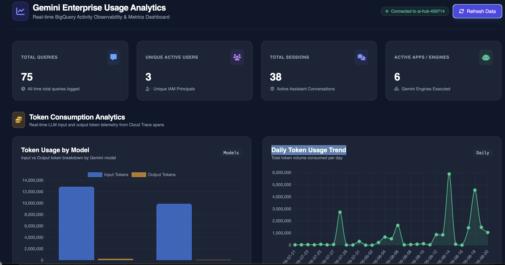
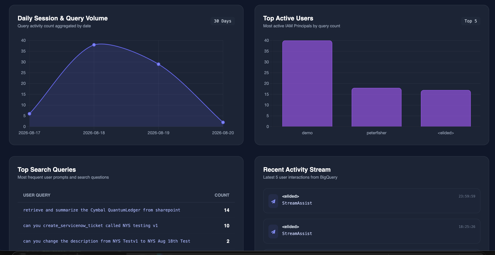

# Gemini Enterprise & NotebookLM Usage Analytics (Sanitized)

> **Disclaimer**: This repository and its contents are provided for illustration and educational purposes only as example code. This is not an official Google product or officially supported Google Cloud project. This code is provided as-is for demonstration purposes and is NOT intended or supported for production workloads. The views, code, and opinions expressed in this repository are those of the author(s) and do not necessarily reflect the position, opinions, or official policy of Google LLC or Google Cloud Platform.

This repository contains tools to extract observability, user behaviors, and interaction metadata from Gemini Enterprise and NotebookLM products on Google Cloud Platform.

## Dashboard Preview





## Project Contents

- **`deploy_all_sanitized.sh`**: Non-interactive automated deployment script taking parameters via environment variables.
- **`enable_audit_logging.sh`**: Enables audit logs globally for the designated Gemini Enterprise App ID.
- **`bigquery_realitime_sink/`**: Real-time BigQuery schema creation and sink binding scripts.
- **`gcs_batch_sink/`**: External BigQuery tables bound to Cloud Storage batch folders.

## Setup & Deployment Instructions

### Automated Non-Interactive Deployment (Recommended)

Pass your GCP `PROJECT_ID` and Gemini `APP_ID` directly to `deploy_all_sanitized.sh` without prompt wizard interactions:

```bash
export PROJECT_ID="your_project_id"
export APP_ID="your_gemini_app_id" # or comma-separated list: "app_1,app_2"

./deploy_all_sanitized.sh
```

### Optional Configuration Overrides

You can optionally override default dataset prefixes and BigQuery locations:

```bash
export PROJECT_ID="your_project_id"
export APP_ID="your_gemini_app_id"
export BQ_LOCATION="US"                           # Default: US
export GE_DATASET_PREFIX="ge_raw_logs_"           # Default: ge_raw_logs_
export NLM_DATASET_PREFIX="nlm_raw_logs_"         # Default: nlm_raw_logs_
export GE_TRANSFORMED_DATASET="ge_transformed"    # Default: ge_transformed
export NLM_TRANSFORMED_DATASET="nlm_transformed"  # Default: nlm_transformed

./deploy_all_sanitized.sh
```

### Interactive Wizard Mode

Alternatively, you can run the interactive wizard:

```bash
cd bigquery_realitime_sink
./interactive_runner.sh
```

Enjoy your usage analytics dashboards!

## Acknowledgements & Attribution

Special thanks to **Upasana Pati** for her work on [usage auditing](https://github.com/upasana1105/UP_Demos/tree/main/gemini-enterprise-usage-analytics) and [observability](https://github.com/upasana1105/UP_Demos/tree/main/gemini_enterprise_observability).
